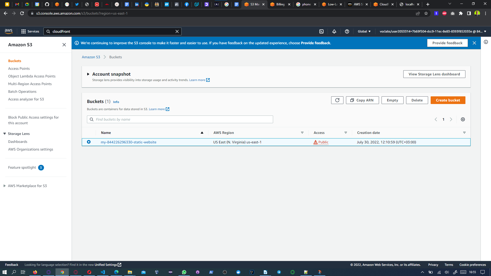
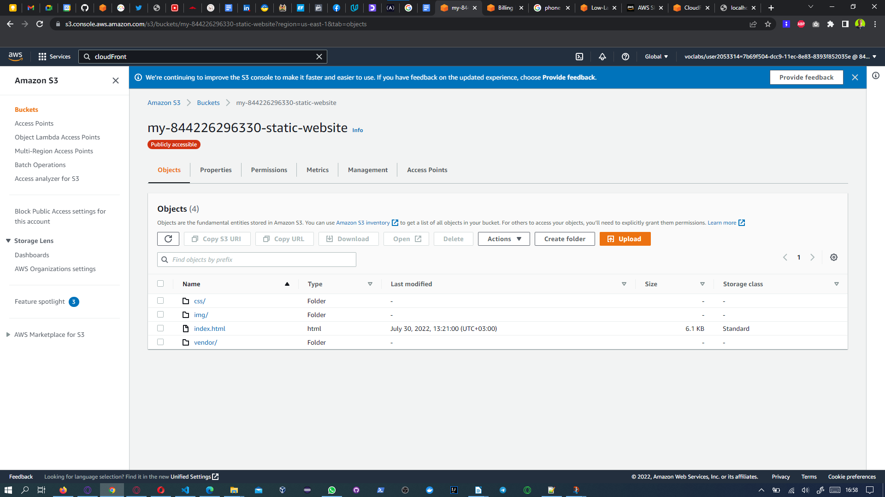
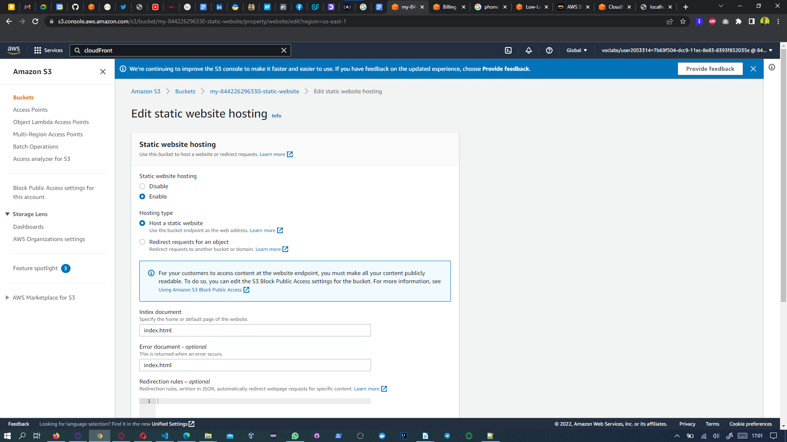
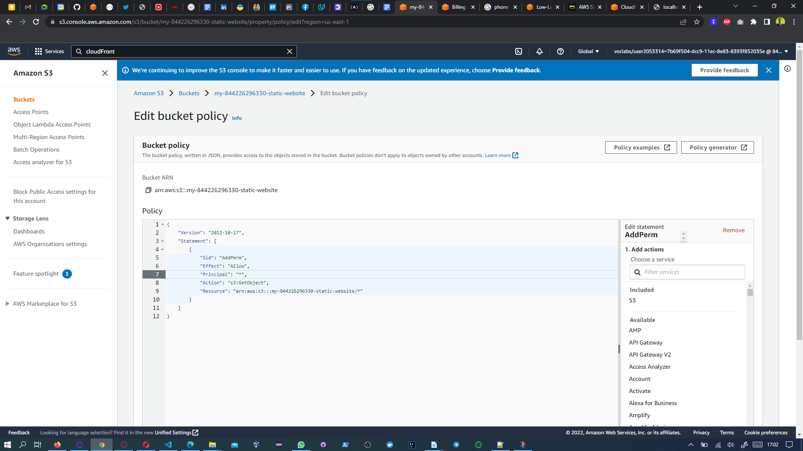
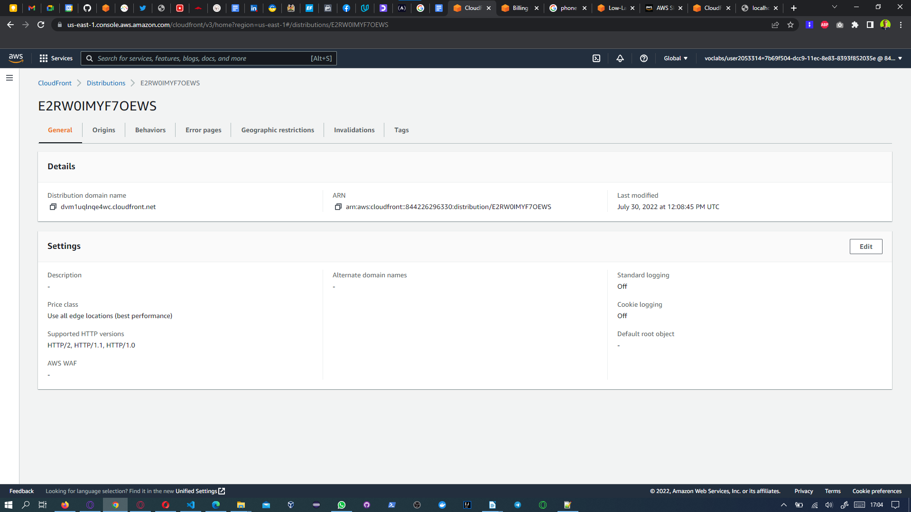
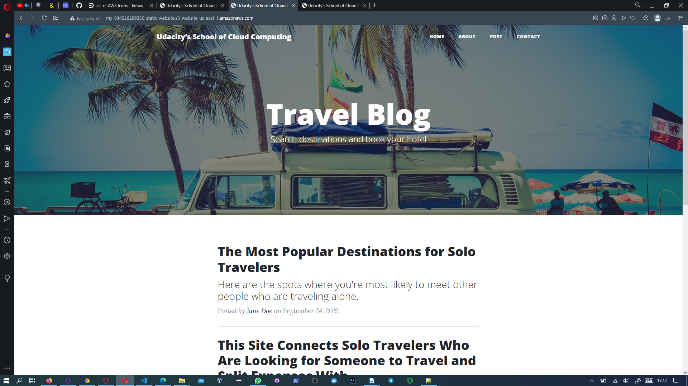

# ALXT Cloud Developer Deploy Static Website on AWS Project

# Project links
https://dvm1uqlnqe4wc.cloudfront.net
 
http://my-844226296330-static-website.s3-website-us-east-1.amazonaws.com

## S3 bucket is visible in the AWS Management console.

## Website files uploaded to the newly created S3 bucket.

## The S3 bucket is configured to support static website hosting.

## The S3 bucket has an IAM bucket policy that makes the bucket contents publicly accessible.

## CloudFront has been configured to retrieve and distribute website files.

## CloudFront domain name URL.
[https://dvm1uqlnqe4wc.cloudfront.net](https://dvm1uqlnqe4wc.cloudfront.net)

## Website-endpoint URL for the website.
[http://my-844226296330-static-website.s3-website-us-east-1.amazonaws.com](http://my-844226296330-static-website.s3-website-us-east-1.amazonaws.com)

## Website Screenshot at CloudFront domain name URL.

